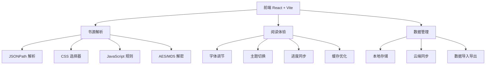

<div align="center">

# 📚 紫枫免费小说 | Zifeng Free Novel Reader

✨ **现代化开源小说阅读器，支持多书源、智能解析、极致阅读体验** ✨

> 🏗️ **当前架构：轻量级三仓分离（方案A）** - 已完成第一阶段重构

[](https://github.com/HAN102300/zifeng-novel-free/stargazers)
[](https://github.com/HAN102300/zifeng-novel-free/network)
[](https://github.com/HAN102300/zifeng-novel-free/blob/main/LICENSE)
[](https://github.com/HAN102300/zifeng-novel-free/issues)

<p align="center">
  
  
  
  
  
</p>

</div>

## 🏗️ 项目架构

### 📦 **当前架构：轻量级三仓分离（方案A）**

```
zifeng-novel/
├── zifeng-web/                        # 前端用户网站
├── zifeng-admin/                      # 后台管理网站  
├── zifeng-server/                     # SpringBoot后端 (模块化单体)
└── zifeng-parser/                     # Express解析引擎 (独立微服务)
```

#### 🔧 **服务端口配置**
- **zifeng-web**: `http://localhost:5173` - 用户前端
- **zifeng-admin**: `http://localhost:3002` - 管理后台
- **zifeng-server**: `http://localhost:8080` - SpringBoot API
- **zifeng-parser**: `http://localhost:3001` - 解析引擎

#### 📁 **后端模块化结构**
- `module-user/` - 用户认证、书架、阅读进度
- `module-source/` - 书源管理、导入导出
- `module-parse/` - 解析代理、缓存处理
- `module-admin/` - 系统管理、统计分析

> 💡 **升级路径**：当用户量增长到5万+时，可平滑升级到微服务架构（方案B）

## 🎯 项目亮点

### 🌟 **为什么选择紫枫免费小说？**

<table>
<tr>
<td width="50%">

#### 🚀 **技术领先**
- ⚡ **React 19 + Vite** 极速构建
- 🎨 **Ant Design 6.x** 精美UI设计
- 📱 **响应式布局** 完美适配移动端
- 🔄 **Framer Motion** 丝滑动画效果

</td>
<td width="50%">

#### 📖 **功能丰富**
- 🔍 **智能搜索** 多书源并行搜索
- 📚 **书架管理** 个人阅读收藏
- 🌙 **暗黑模式** 护眼阅读体验
- ⚙️ **个性设置** 字体、背景、间距调节

</td>
</tr>
</table>

## ✨ 核心功能

### 🎨 **精美界面设计**

| 功能 | 描述 | 预览 |
|------|------|------|
| **🏠 首页推荐** | 热门榜单、分类导航、个性化推荐 |  |
| **📖 沉浸阅读** | 多种主题、字体调节、进度同步 |  |
| **📚 智能书架** | 阅读记录、收藏管理、进度追踪 |  |
| **⚙️ 书源管理** | 自定义书源、规则编辑、在线导入 |  |

### 🔧 **强大技术特性**



### 🌐 **书源支持能力**

<div align="center">

| 书源类型 | 支持度 | 技术实现 | 示例 |
|---------|--------|----------|------|
| **🔗 API接口** | ✅ 100% | JSONPath + 模板引擎 | 猫眼看书、书旗小说 |
| **🌐 HTML网页** | ✅ 100% | CSS选择器 + Cheerio | 起点中文网、纵横中文网 |
| **⚡ JS脚本** | ✅ 90% | JavaScript引擎 + 沙箱 | 番茄小说、七猫小说 |
| **🔐 登录验证** | ✅ 85% | Cookie管理 + 自动化 | 需要登录的聚合站点 |

</div>

## 🚀 快速开始

### 📋 **前置要求**

- 🐰 **Node.js 18+**
- ☕ **Java 17+** (用于SpringBoot后端)
- 🛢️ **MySQL 8.0+**
- 🔴 **Redis**
- 📦 **Maven** (用于Java后端构建)
- 💻 **现代浏览器**

### 🛠️ **本地开发**

#### 方案1️⃣：一键启动脚本（推荐）

```bash
# 克隆项目
git clone https://github.com/HAN102300/zifeng-novel-free.git
cd zifeng-novel-free

# 运行启动脚本 (Linux/Mac)
./start-dev.sh
```

#### 方案2️⃣：手动启动各服务

```bash
# 1️⃣ 启动解析引擎服务
cd zifeng-parser
npm install
npm start

# 2️⃣ 启动SpringBoot后端 (新终端)
cd zifeng-server
mvn spring-boot:run

# 3️⃣ 启动用户前端 (新终端)
cd zifeng-web
npm install
npm run dev

# 4️⃣ 启动管理后台 (新终端)
cd zifeng-admin
npm install
npm run dev

# 🎉 访问服务：
# 用户端: http://localhost:5173
# 管理后台: http://localhost:3002
# API文档: http://localhost:8080/swagger-ui.html
```

#### 方案3️⃣：Docker部署

```bash
# 使用Docker Compose启动所有服务
docker-compose up -d
```

### 🔧 **环境配置**

#### 数据库配置
确保MySQL和Redis服务已启动，并创建数据库：
```sql
CREATE DATABASE zifeng_novel CHARACTER SET utf8mb4 COLLATE utf8mb4_unicode_ci;
```

#### 配置文件
- `zifeng-server/src/main/resources/application.yml` - SpringBoot配置
- `zifeng-parser/.env` - 解析服务配置
- `.env.development` - 前端开发环境配置

### 🏗️ **生产部署**

#### 方案一：单服务器部署（推荐）

```bash
# 构建前端
npm run build

# 启动后端（包含静态文件服务）
cd server
npm start

# 访问 http://your-domain:3001
```

#### 方案二：Docker部署

```dockerfile
FROM node:18-alpine

WORKDIR /app

# 安装依赖并构建
COPY package*.json ./
RUN npm install
COPY . .
RUN npm run build

# 启动服务
WORKDIR /app/server
RUN npm install
EXPOSE 3001
CMD ["node", "index.js"]
```

```bash
docker build -t zifeng-novel-reader .
docker run -p 3001:3001 zifeng-novel-reader
```

#### 方案三：云平台部署

| 平台 | 状态 | 说明 |
|------|------|------|
| **🌊 Vercel** | ✅ 完美支持 | 前端静态部署 |
| **🚂 Railway** | ✅ 完美支持 | 全栈应用部署 |
| **☁️ Render** | ✅ 完美支持 | 简单易用 |

## 📖 使用指南

### 🎯 **基础使用**

1. **📖 开始阅读**
   - 访问首页浏览推荐书籍
   - 使用搜索功能查找目标小说
   - 点击书籍封面进入详情页

2. **⚙️ 配置书源**
   - 进入设置页面管理书源
   - 导入预设书源或自定义添加
   - 启用/禁用特定书源

3. **📱 个性化设置**
   - 调整字体大小和行间距
   - 切换明亮/暗黑主题
   - 设置阅读背景颜色

### 🔧 **高级功能**

#### 书源规则说明

```javascript
// 📋 JSONPath 规则示例
{
  "bookList": "$.data[*]",           // 获取所有书籍
  "name": "$.novelName",             // 书名
  "author": "$.authorName",          // 作者
  "coverUrl": "$.cover",             // 封面
  "intro": "$.summary"               // 简介
}

// 🎨 CSS选择器规则示例
{
  "bookList": ".book-item",          // 书籍列表
  "name": ".title@text",            // 书名
  "author": ".author@text",         // 作者
  "coverUrl": ".cover@src"           // 封面
}

// ⚡ JavaScript规则示例
{
  "content": "<js>\n// 自定义JS处理\nlet content = result;\n// 解密或处理内容\nreturn content;\n</js>"
}
```

#### 登录配置示例

```json
{
  "loginUi": [
    {
      "name": "用户名",
      "type": "text",
      "placeholder": "请输入用户名"
    },
    {
      "name": "密码",
      "type": "password",
      "placeholder": "请输入密码"
    },
    {
      "name": "登录",
      "type": "button",
      "action": "login()"
    }
  ]
}
```

## 🎨 界面预览

### 🌈 **多彩主题**

<div align="center">
<table>
<tr>
<td align="center">
<br/>
<b>默认主题</b>
</td>
<td align="center">
<br/>
<b>暗黑主题</b>
</td>
<td align="center">
<br/>
<b>护眼主题</b>
</td>
</tr>
</table>
</div>

### 📱 **响应式设计**

<div align="center">
<table>
<tr>
<td align="center">
<br/>
<b>桌面端</b>
</td>
<td align="center">
<br/>
<b>平板端</b>
</td>
<td align="center">
<br/>
<b>手机端</b>
</td>
</tr>
</table>
</div>

## 🤝 贡献指南

### 💡 **如何贡献？**

1. **🍴 Fork 本项目**
2. **🌿 创建特性分支** `git checkout -b feature/AmazingFeature`
3. **✨ 提交更改** `git commit -m 'Add some AmazingFeature'`
4. **🚀 推送分支** `git push origin feature/AmazingFeature`
5. **🎉 提交 Pull Request**

### 🎯 **贡献方向**

- 📚 **添加新书源** - 分享优质书源，完善书源规则
- 🎨 **界面优化** - 改进UI/UX设计，提升用户体验
- ⚡ **性能优化** - 提升加载速度，优化资源占用
- 🐛 **问题修复** - 修复已知bug，增强稳定性
- 📖 **文档完善** - 改进使用文档，添加教程示例
- 🌐 **多语言支持** - 增加国际化支持
- 🔧 **功能扩展** - 开发新功能，提升产品竞争力

## 📄 开源协议

本项目采用 **MIT License** - 查看 [LICENSE](LICENSE) 文件了解详情

## 🙏 致谢

### 🎨 技术栈

### 前端技术
- [React](https://reactjs.org/) - 现代化前端框架
- [Vite](https://vitejs.dev/) - 极速构建工具
- [Ant Design](https://ant.design/) - 企业级UI组件库
- [Framer Motion](https://framer.com/motion/) - 流畅动画效果
- [Axios](https://axios-http.com/) - HTTP客户端

### 后端技术
- [Node.js](https://nodejs.org/) - 运行环境
- [Express](https://expressjs.com/) - 轻量级Web框架
- [Cheerio](https://cheerio.js.org/) - HTML解析库
- [JSONPath](https://github.com/jsonpath/jsonpath) - JSON数据解析
- [crypto-js](https://github.com/brix/crypto-js) - 加密解密工具

### 📚 **灵感来源**

- [Legado](https://github.com/gedoor/legado) - 开源阅读
- [阅读](https://github.com/evorion/iread) - 小说阅读器

### 👥 **贡献者**

<a href="https://github.com/HAN102300/zifeng-novel-free/graphs/contributors">
  
</a>

## 📞 联系我们

### 💬 **交流渠道**

- 🐛 **问题反馈**: [GitHub Issues](https://github.com/HAN102300/zifeng-novel-free/issues)
- 💡 **功能建议**: [GitHub Discussions](https://github.com/HAN102300/zifeng-novel-free/discussions)
- 📧 **邮件联系**: 2692528141@qq.com

### 🌟 **支持项目**

如果这个项目对你有帮助，请考虑：

- ⭐ **给个 Star** 让更多人发现
- 🍴 **Fork 项目** 参与开发
- 💬 **分享推荐** 给更多朋友

---

<div align="center">

## 🌟 **让阅读成为享受，让知识自由流动** 🌟

<p align="center">
  
  
</p>

</div>

---

<div align="center">

**[⬆ 回到顶部](#-紫枫免费小说--zifeng-free-novel-reader)**

</div>