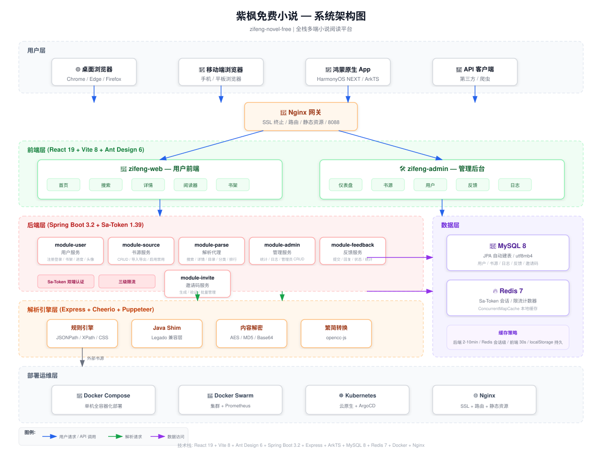

<div align="center">

# 🌸 紫枫免费小说

**现代化开源小说阅读平台 — 聚合多书源 · 沉浸式阅读 · 自由无界**

[](https://github.com/HAN102300/zifeng-novel-free/stargazers)
[](https://github.com/HAN102300/zifeng-novel-free/network)
[](https://github.com/HAN102300/zifeng-novel-free/blob/master/LICENSE)
[](https://github.com/HAN102300/zifeng-novel-free/issues)

<br/>


<br/>

*让阅读成为享受，让知识自由流动* 🌸

</div>

---

## 目录

- [为什么选择紫枫](#-为什么选择紫枫)
- [功能全景](#-功能全景)
- [设计系统 zifeng-ui](#-设计系统--zifeng-ui)
- [系统架构](#-系统架构)
- [技术亮点](#-技术亮点)
- [书源解析能力](#-书源解析能力)
- [安全与性能](#-安全与性能)
- [快速开始](#-快速开始)
- [环境配置](#-环境配置)
- [生产部署架构](#-生产部署架构)
- [参与贡献](#-参与贡献)

---

## ✨ 为什么选择紫枫？

<table>
<tr>
<td width="25%" valign="top">

### 🔍 聚合搜索
多书源**并行**检索，一键触达全网小说。支持 API、HTML、JS 脚本等多种解析规则，兼容 Legado 书源格式，内置书源测活与自动重登。

</td>
<td width="25%" valign="top">

### 📖 沉浸阅读
8 套阅读主题、字号 / 行距 / 背景自由调节、章节缓存与预加载、目录抽屉与虚拟滚动。正文采用衬线字体与受约束的行长，为长文阅读而设计。

</td>
<td width="25%" valign="top">

### 🎨 设计系统
独立的 `zifeng-ui` 共享层：**440 个设计令牌**、OKLCH 品牌色阶派生、13 个跨端组件、特效分级预算。改一处品牌色，两端视觉同时跟随。

</td>
<td width="25%" valign="top">

### 🏗️ 全栈架构
前后端分离 + 独立解析引擎。Spring Boot 负责业务与鉴权，Express 负责书源解析，Nginx 统一网关，Docker Compose 一键起全栈。

</td>
</tr>
</table>

---

## 🖼️ 功能全景

### 📱 用户端（`zifeng-web`）

<table>
<tr>
<th width="25%">🏠 首页推荐</th>
<th width="25%">🔍 聚合搜索</th>
<th width="25%">📖 沉浸阅读</th>
<th width="25%">📚 智能书架</th>
</tr>
<tr>
<td>

- 六大榜单（必读 / 潜力 / 完结 / 更新 / 搜索 / 评论）
- 内容驱动 Hero：真实封面 + 搜索入口 + 热门检索词
- 磁吸玻璃导航与共享元素转场
- 分类导航快速探索

</td>
<td>

- 多书源并行搜索，边到边渲染
- 实时进度展示与中途取消
- 书源状态条（成功 / 无结果 / 失败 + 耗时）
- 列表 / 网格双视图，搜索历史与热词建议

</td>
<td>

- 8 套主题（暗夜 / 护眼绿 / 羊皮纸 …）
- 字号、行距、背景图自由调节并持久化
- 章节缓存 + 目录抽屉 + 上下章导航
- 阅读进度本地与云端双同步

</td>
<td>

- 收藏管理与阅读进度追踪
- 历史 / 收藏双区，列表与网格切换
- 进度条可视化
- 一键续读上次章节

</td>
</tr>
<tr>
<th>📂 分类浏览</th>
<th>🏆 排行榜单</th>
<th>⚙️ 个性设置</th>
<th>👤 个人中心</th>
</tr>
<tr>
<td>

- 男频 / 女频双频道
- 玄幻 / 都市 / 仙侠等细分题材
- 分类详情分页加载与页码记忆
- 分类封面预览

</td>
<td>

- 榜单详情页三视图（列表 / 网格 / 表格）
- 排名徽章与热度指标
- 分页浏览更多内容
- 一键跳转书籍详情

</td>
<td>

- 5 套品牌主题（OKLCH 派生色阶）
- 深浅模式 + 自动夜间时段
- 毛玻璃 / 实底双模式
- 全局字号调节

</td>
<td>

- 头像裁剪上传
- 个人资料编辑
- 密码修改与找回
- 反馈历史查看

</td>
</tr>
</table>

### 🛠️ 管理后台（`zifeng-admin`）

<table>
<tr>
<th width="25%">📊 数据概览</th>
<th width="25%">📝 访问日志</th>
<th width="25%">📚 书源管理</th>
<th width="25%">👥 用户管理</th>
</tr>
<tr>
<td>

- KPI 指标卡（访问 / 用户 / 收藏 / 记录）
- 访问趋势与 IP 分布
- 30+ 接口访问统计

</td>
<td>

- 多条件筛选（IP / 路径 / UA / 属地）
- 访客类型过滤（管理员 / 用户 / 游客）
- 批量删除 + 二次确认
- 分页与时间排序

</td>
<td>

- 书源列表 CRUD
- 分组规则编辑器（基本 / 搜索 / 详情 / 目录 / 正文 / 发现）
- JSON / URL / 拖拽三种导入
- 书源统计看板

</td>
<td>

- 用户列表与检索
- 启用 / 禁用状态切换
- 管理员分级（超管 / 普通管理员）
- 管理员独立认证体系

</td>
</tr>
<tr>
<th>🔬 书源测活</th>
<th>💬 用户反馈</th>
<th>📖 阅读管理</th>
<th>🔧 系统管理</th>
</tr>
<tr>
<td>

- 一键测试书源可用性
- 多阶段检测（搜索 → 详情 → 目录 → 正文）
- 成功率与失败原因展示
- 批量测试 + 结果汇总

</td>
<td>

- 反馈统计卡（待处理 / 处理中 / 已解决 / 已关闭）
- 类型与状态筛选
- 管理员回复与状态流转
- 反馈详情查看

</td>
<td>

- 书架记录检索
- 阅读历史与进度
- 按用户 / 书源维度查看

</td>
<td>

- 管理员 CRUD 与密码重置
- 访问日志归档
- 系统参数调优

</td>
</tr>
</table>

---

## 🎨 设计系统 · `zifeng-ui`

这是本项目区别于一般模板的地方：**视觉规则被抽成一个独立、可校验、跨端共享的层**，而不是散落在各页面的内联样式里。

### 单一真源 → 两端同源

```
zifeng-ui/tokens/hue.js        ← 唯一需要改的地方（每套品牌一行 hue / chroma）
        ↓  OKLCH 派生
zifeng-ui/tokens/brand.js      ← 10 级色阶 + 渐变 / 光晕 / ring / tint
        ↓  生成期穷举
zifeng-ui/css/tokens.css       ← :root + [data-theme=light] + 5×[data-brand] + 3×[data-fx]
        ↓
   CSS 变量 ──┬── JS 对象（antd ConfigProvider 组件级 token）
             └── framer-motion 缓动数组
```

运行时只需切换 `html[data-theme]` 与 `html[data-brand]` 两个属性 —— 渐变、光晕、滚动条、选区、描边、阴影、antd 主色**全部自动跟随**，不需要 JS 打补丁，也不会出现「切了主题但一半组件还是旧色」的漂移。

### 能力清单

| 目录 | 内容 |
|:-----|:-----|
| `tokens/` | 品牌色阶、墨阶 / 纸色、状态与排名色、图表序列色、表面层级、排版 scale、8pt 间距、圆角、阴影、z-index、容器宽度、断点、动效曲线、特效预算、阅读主题 |
| `css/` | `reset.css` · `tokens.css`（生成物）· `utilities.css` · `keyframes.css` |
| `antd/` | `buildAntdTheme()` —— 含**组件级 token**（Layout / Card / Modal / Table / Menu / Pagination / Segmented / Descriptions / Skeleton / Tabs / Button / Tag / Drawer / Tooltip）与 `zhCN` locale |
| `motion/` | `EASE` / `DUR` / `SPRING` 与 `variants`（fadeUp / cardIn / listRise / reveal / maskReveal / pageFade / pageSlide），`FxProvider` 特效分级 |
| `components/` | 13 个跨端组件：`ZfPageShell` `ZfPageHeader` `ZfFooter` `ZfSectionTitle` `ZfGlassSurface` `ZfAmbient` `ZfPill` `ZfStatCard` `ZfCoverCard` `ZfSkeleton` `ZfEmptyState` `ZfErrorBoundary` |
| `hooks/` | `useBreakpoint` `useMediaQuery` `useTicker`（全站单例 rAF 广播）`useInViewOnce` `useScrollProgress` |
| `format/` | 数字 / 热度 / 评分 / 相对时间格式化，标签串清洗与拆分 |
| `charts/` | G2 语义化调色板、统一尺寸档位、`splitByMagnitude` 数量级护栏 |
| `scripts/` | `build-css.mjs`（生成令牌）、`check-tokens.mjs`（校验） |

### 特效预算：更炫，但不掉帧

动效强度由 `FxProvider` 判定为三档并写到 `html[data-fx]`：

| tier | 触发条件 | 表现 |
|:-----|:---------|:-----|
| **0 基础** | `prefers-reduced-motion` / 弱硬件 | 无 infinite 动画、无视差、无 3D 倾斜，转场降为纯透明度 |
| **1 标准** | 触屏 / 窄屏 / 核数少 | 3 颗光球、骨架微光、一次性入场动效 |
| **2 全效** | 桌面端 | 5 颗光球 + 光标光晕 + 视差 + 封面 3D 倾斜 + 共享元素转场 + 水墨转场 |

所有 infinite 动画统一挂 `animation-play-state: var(--zf-fx-loop)`，一个总闸即可静止。并遵守三条合成器铁律：

1. 单元素不得同时具备 `backdrop-filter` + `filter:blur()` + infinite 动画
2. infinite 动画必须是玻璃卡的**兄弟层**，不能是子孙（否则每帧重采样 backdrop）
3. `will-change` 只由 JS 在交互期间动态加，不写静态 CSS

### 可校验性

```bash
node zifeng-ui/scripts/build-css.mjs      # 改完令牌源后重新生成
node zifeng-ui/scripts/check-tokens.mjs   # 悬空引用 / 孤儿令牌 / 硬编码色 / 内联样式统计
```

`check-tokens` 会扫描两端 `src/**`，报告：写了 `var(--zf-*)` 但令牌里不存在的**悬空引用**、定义了却无人使用的**孤儿令牌**、白名单外的**硬编码颜色**、以及 `style={{` **内联样式**分布。这让「设计系统没有被绕过」成为一条可回归检查的客观指标，而非口头约定。

> **接入方式**：`zifeng-ui` 不经 npm 安装，由两端 `vite.config.js` 的 `resolve.alias` 指向该目录，并配 `resolve.dedupe` 防止 React 多实例。**零 `node_modules` 变更、零 lock 改动。**

---

## 🏗️ 系统架构



### 项目目录结构

```
zifeng-novel-free/
├── zifeng-web/               用户端（React 19 + Vite 8 + antd 6 + framer-motion）
│   ├── src/pages/            14 个页面
│   ├── src/components/       导航栏、反馈入口等业务组件
│   ├── src/hooks/            useTheme / useAuth / useRankData …
│   ├── src/contexts/         AuthContext · NovelContext · ThemeContext
│   └── src/utils/            apiClient · bookSourceManager · novelConfig · cryptoConfig
│
├── zifeng-admin/             管理后台（React 19 + antd 6 + @ant-design/charts）
│   ├── src/pages/            11 个页面（仪表盘 / 用户 / 阅读 / 书源 / 反馈 / 管理员）
│   └── src/utils/            adminApi（含缓存与限流处理）· bookSourceManager
│
├── zifeng-ui/                ★ 共享设计令牌层（两端同源，见上一章）
│   ├── tokens/  css/  antd/  motion/  hooks/  format/  charts/  components/
│   ├── scripts/            build-css.mjs · check-tokens.mjs
│   └── MIGRATION.md        逐页迁移规约
│
├── zifeng-server/            后端服务（Spring Boot 3.2 + JPA + Sa-Token）
│   └── src/main/java/com/zifeng/
│       ├── config/           缓存 · 限流 · CORS · Sa-Token · 数据初始化
│       └── module/           user · source · parse · admin · feedback · invite
│
├── zifeng-parser/            解析引擎（Express + Cheerio + Puppeteer）
│   ├── index.js              服务入口与 API 路由
│   ├── ruleEngine.js         规则引擎（JSONPath / XPath / CSS / JS）
│   ├── legadoEngine.js       Legado 规则适配
│   ├── javaShim.js           Java 方法模拟层（ajax / 加密 / 编码）
│   └── selectors.js          选择器实现
│
├── deploy/                   部署配置
│   ├── nginx/                nginx-gateway.conf · zifeng-local.conf
│   └── init/                 mysql-init.sql
│
├── docker-compose.yml        全栈容器编排
├── start-dev.py              开发环境一键启动
└── stop-dev.py               开发环境一键停止
```

### 服务与端口

| 服务 | 端口 | 说明 |
|:-----|:-----|:-----|
| Nginx 网关 | `8088` | 反向代理 + 前端静态资源（一键脚本 / 生产模式） |
| `zifeng-web` dev | `5173` | Vite 开发服务器 |
| `zifeng-admin` dev | `3002` | Vite 开发服务器，base 为 `/admin/` |
| `zifeng-server` | `8080` | Spring Boot REST API |
| `zifeng-parser` | `3001` | 书源解析引擎 |
| MySQL | `3306` | 数据库 `zifeng_novel` |
| Redis | `6379` | 缓存与会话 |

开发模式下两个前端各自通过 Vite `proxy` 转发 `/api/*`：解析类接口走 `3001`，业务接口走 `8080`，**无需 Nginx 即可直接开发**。

### 后端模块

| 模块 | 职责 | 核心功能 |
|:-----|:-----|:---------|
| `module/user` | 用户服务 | 注册登录、书架管理、阅读进度、头像上传 |
| `module/source` | 书源服务 | 书源 CRUD、JSON/URL 导入导出、启用禁用 |
| `module/parse` | 解析服务 | 搜索 / 详情 / 目录 / 正文解析、分类与排行接口、解析代理 |
| `module/admin` | 管理服务 | 数据统计、访问日志、管理员 CRUD |
| `module/feedback` | 反馈服务 | 反馈提交、管理员回复、状态流转、统计 |
| `module/invite` | 邀请码服务 | 邀请码生成、验证、批量管理 |

---

## 🔧 技术亮点

### 前端

| 技术 | 版本 | 用途 |
|:-----|:-----|:-----|
| **React** | 19 | 并发渲染，路由级懒加载与代码分割 |
| **Vite** | 8 | 毫秒级 HMR 与构建 |
| **Ant Design** | 6 | 组件库；通过**组件级 token** 定制，不靠 `!important` 覆盖 |
| **Framer Motion** | 12 | 共享元素过渡、滚动驱动视差、封面 3D 倾斜、水墨转场 |
| **Design Tokens** | — | `zifeng-ui` 440 个令牌，OKLCH 派生，两端同源 |
| **Crypto-JS** | 4 | 前端内容解密 |
| **React Avatar Editor** | 15 | 头像裁剪上传 |

### 后端

| 技术 | 版本 | 用途 |
|:-----|:-----|:-----|
| **Spring Boot** | 3.2.5 | Java 17+ 应用框架 |
| **Sa-Token** | 1.39 | 轻量权限认证，用户端 / 管理端令牌域隔离 |
| **Spring Data JPA** | — | 数据持久层，`ddl-auto: update` 自动建表 |
| **Redis** | 7+ | 会话缓存 + 限流计数器 |
| **ConcurrentMapCache** | — | 本地缓存（10 区域，2~10 分钟 TTL） |
| **RateLimitFilter** | — | 三级限流（认证 5/60s · 全局 100/60s · 单接口 30/60s） |
| **VisitLogInterceptor** | — | 30+ 接口访问统计 + 10s 去重窗口 |
| **ip2region** | — | 本地 xdb 归属地检索 |

### 解析引擎

| 技术 | 用途 |
|:-----|:-----|
| **Cheerio** | HTML DOM 高速解析 |
| **Puppeteer** | 动态页面渲染，突破 JS 反爬 |
| **JSONPath + XPath + CSS Selector** | 三重规则引擎 |
| **crypto-js** | AES / MD5 / Base64 内容解密 |
| **iconv-lite** | GBK 等多编码自动识别 |
| **opencc-js** | 繁简中文自动转换 |
| **Java Shim Layer** | 模拟 Legado Java 运行时（`sourceVariables` / `ajax` / `base64` 等） |

---

## 🌐 书源解析能力

| 规则类型 | 支持度 | 引擎 | 典型场景 |
|:---------|:-------|:-----|:---------|
| **API 接口** | ✅ 完整 | JSONPath + 模板引擎 | RESTful 小说站 |
| **HTML 页面** | ✅ 完整 | CSS 选择器 + Cheerio | 传统网页站点 |
| **JS 动态页** | ✅ 完整 | Puppeteer + 沙箱执行 | SPA / 反爬站点 |
| **JS 脚本规则** | ✅ 完整 | `@js:` / `<js>` 沙箱 + Java Shim | 动态 URL 生成 / 加密参数 |
| **加密内容** | ✅ 完整 | AES / MD5 / Base64 | 加密小说源 |
| **登录站点** | ✅ 完整 | Cookie 管理 + 浏览器自动化 | 需认证的聚合站 |
| **模板变量** | ✅ 完整 | `{{page}}` / `{{key}}` / `{{MLDS}}` | 动态参数替换 |
| **繁简转换** | ✅ 完整 | opencc-js | 繁体书源自动转简体 |
| **发现页** | ✅ 完整 | `ruleExplore` | 分类分组浏览 |

---

## 🔒 安全与性能

### 认证体系

```
┌─────────────────────────────────────────────────┐
│              Sa-Token 双域认证                   │
├────────────────────┬────────────────────────────┤
│    用户端认证       │      管理端认证             │
│  StpUtil (user)    │  StpAdminUtil (admin)      │
│  登录 → Token      │  登录 → Admin Token        │
│  书架/进度/设置     │  仪表盘/书源/用户管理        │
│  单设备登录         │  多设备登录                 │
└────────────────────┴────────────────────────────┘
```

- 登录**验证码**校验 + 可配置的**邀请码**准入（`INVITE_CODE_REQUIRED`）
- 密码 BCrypt 存储；书源登录凭据加密后落库
- 图片与外链内容统一走代理，规避防盗链与混合内容

> ⚠️ **部署前必读**：首次启动会由 `zifeng-server/src/main/java/com/zifeng/config/DataInitializer.java` 创建一个默认超级管理员。请**立即修改该账号密码**，并在生产环境移除该自动初始化逻辑。

### 限流策略

| 层级 | 限制 | 窗口 | 适用范围 |
|:-----|:-----|:-----|:---------|
| 认证接口 | 5 次 | 60 秒 | `/api/auth/login`、`/api/admin/login` |
| 全局请求 | 100 次 | 60 秒 | 所有接口 |
| 单接口 | 30 次 | 60 秒 | 每个 API 路径独立计数 |

此外，解析请求设有超时与并发上限，避免单个慢书源拖垮整次聚合搜索。

### 缓存架构

| 缓存层 | 技术 | TTL | 适用场景 |
|:-------|:-----|:----|:---------|
| 浏览器内存 | LRU Cache | 会话内 | 章节正文与目录，重复打开零请求 |
| 前端持久层 | localStorage | 持久 | 书源列表 · 阅读设置 · 主题偏好 · 阅读器缓存 |
| 后端服务缓存 | ConcurrentMapCache | 2~10 分钟 | 仪表盘 / 书源 / 用户 / 管理员数据 |
| Redis 缓存 | Redis | 会话级 | Sa-Token 会话 + 限流计数器 |
| 管理端请求缓存 | Memory Cache | 30 秒 | 后台 API 请求去重 |

---

## 🚀 快速开始

### 前置要求

| 依赖 | 版本 | 用途 |
|:-----|:-----|:-----|
| Node.js | 18+ | 前端 & 解析引擎 |
| Java (JDK) | 17+ | Spring Boot 后端 |
| Maven | 3.8+ | Java 项目构建 |
| MySQL | 8.0+ | 数据存储 |
| Redis | 7+ | 缓存 & 会话 |
| Nginx | 1.20+ | 仅「一键脚本 / 生产」模式需要 |

### 方式一：开发模式（推荐日常开发）

不需要 Nginx，两个前端各自热更新、自行代理 API。

```bash
git clone https://github.com/HAN102300/zifeng-novel-free.git
cd zifeng-novel-free

# 1. 安装依赖（三个 Node 工程各自独立）
cd zifeng-parser && npm install && cd ..
cd zifeng-web    && npm install && cd ..
cd zifeng-admin  && npm install && cd ..

# 2. 建库（连接信息见 zifeng-server/src/main/resources/application.yml）
mysql -uroot -p -e "CREATE DATABASE zifeng_novel CHARACTER SET utf8mb4 COLLATE utf8mb4_unicode_ci;"

# 3. 启动解析引擎（:3001）
cd zifeng-parser && npm run dev

# 4. 启动 Spring Boot 后端（:8080，新终端）
cd zifeng-server && mvn spring-boot:run

# 5. 启动用户端（:5173，新终端）
cd zifeng-web   && npm run dev

# 6. 启动管理后台（:3002/admin/，新终端）
cd zifeng-admin && npm run dev
```

改动设计令牌后重新生成并校验：

```bash
node zifeng-ui/scripts/build-css.mjs
node zifeng-ui/scripts/check-tokens.mjs
```

### 方式二：一键启动（Nginx 网关模式）

```bash
python start-dev.py    # 自动构建前端 + 启动 Nginx(:8088) + 解析引擎 + 后端
python stop-dev.py     # 停止全部服务
```

脚本会自动完成：检查系统依赖（Node.js / Java / Maven / Nginx）→ 构建两个前端 → 装载 Nginx 配置并启动 → 拉起解析引擎与后端。Nginx 位置可用环境变量 `NGINX_HOME` 指定。

启动后访问：

- **用户端** http://localhost:8088
- **管理后台** http://localhost:8088/admin

### 方式三：手动构建 + Nginx

```bash
# 1. 构建用户前端（生成 dist 产物）
cd zifeng-web && npm install && npm run build

# 2. 构建管理后台
cd ../zifeng-admin && npm install && npm run build

# 3. 启动 Nginx（将 deploy/nginx/nginx-gateway.conf 引入主配置后启动）
nginx

# 4. 解析引擎（新终端）
cd ../zifeng-parser && npm install && npm start

# 5. Spring Boot 后端（新终端）
cd ../zifeng-server && mvn spring-boot:run
```

### 方式四：Docker Compose 生产部署

```bash
# 1. 准备环境变量
cp .env.example .env.local
#    编辑 .env.local 填入实际的数据库 / Redis 密码与端口

# 2. 启动全栈
docker compose up -d --build

# 3. 查看运行状态
docker compose ps
docker compose logs -f zifeng-server
```

服务包含：**Nginx 网关 + Spring Boot + Parser + Web + Admin + MySQL + Redis**。配置项见根目录 `docker-compose.yml` 与 `.env.local`。

---

## 📁 环境配置

| 配置文件 | 说明 |
|:---------|:-----|
| `zifeng-server/src/main/resources/application.yml` | Spring Boot 主配置 |
| `zifeng-server/src/main/resources/application-prod.yml` | 生产环境配置 |
| `.env.example` | 环境变量模板（复制为 `.env.local` 使用） |
| `.env.production` | 生产环境变量配置 |
| `deploy/nginx/nginx-gateway.conf` | Nginx 生产网关路由配置 |
| `deploy/nginx/zifeng-local.conf` | Nginx 本地开发配置 |
| `deploy/init/mysql-init.sql` | 数据库初始化脚本 |

主要环境变量：

| 变量 | 默认 | 说明 |
|:-----|:-----|:-----|
| `VITE_API_URL` | `/api` | 前端 API 基址 |
| `VITE_MAOYAN_KEY` / `_IV` / `_AUTH_TOKEN` | 空 | 猫眼书源接入（可选） |
| `MYSQL_USER` / `MYSQL_ROOT_PASSWORD` / `MYSQL_PORT` | — | 数据库 |
| `REDIS_HOST` / `REDIS_PORT` / `REDIS_PASSWORD` | — | 缓存 |
| `NGINX_HTTP_PORT` / `NGINX_HTTPS_PORT` | `80` / `443` | 网关 |
| `SERVER_PORT` / `PARSER_PORT` | `8080` / `3001` | 后端与解析引擎 |
| `CORS_ORIGINS` | — | 允许跨域来源 |
| `INVITE_CODE_REQUIRED` | `false` | 是否开启注册邀请码 |
| `ADMIN_INITIAL_PASSWORD` | — | 首次启动的管理员密码 |

---

## 🐳 生产部署架构

```
        ┌─────────────┐      ┌─────────────┐
        │  Web 浏览器  │      │ Admin 浏览器 │
        │ :80 / :443  │      │  /admin     │
        └──────┬──────┘      └──────┬──────┘
               │                    │
               └─────────┬──────────┘
                         ▼
                ┌──────────────┐
                │  Nginx 网关  │  :80 / :443
                │ (SSL + 路由)  │
                └──────┬───────┘
                       │
         ┌─────────────┼─────────────┐
         ▼             ▼             ▼
   ┌──────────┐  ┌──────────┐  ┌──────────┐
   │   Web    │  │  Admin   │  │  Server  │  :8080
   │ (静态站)  │  │ (静态站)  │  │  Spring  │
   └──────────┘  └──────────┘  └─────┬────┘
                                     │
                            ┌────────┼────────┐
                            ▼        ▼        ▼
                      ┌─────────┐ ┌──────┐ ┌────────┐
                      │ Parser  │ │MySQL │ │ Redis  │
                      │ :3001   │ │:3306 │ │ :6379  │
                      └─────────┘ └────── └────────┘
```

### 部署工具链

| 工具 | 用途 |
|:-----|:-----|
| **Docker Compose** | 单机全容器化部署 |
| **Nginx** | 网关路由 + SSL 终止 + 静态资源服务 |
| **start-dev.py / stop-dev.py** | 本地一键启停与依赖自检 |

---

## 🤝 参与贡献

1. **Fork** 本仓库
2. 创建特性分支 `git checkout -b feature/AmazingFeature`
3. 提交更改 `git commit -m 'Add some AmazingFeature'`
4. 推送分支 `git push origin feature/AmazingFeature`
5. 提交 **Pull Request**

提交前请本地跑通：

```bash
cd zifeng-web   && npm run lint && npm run build
cd zifeng-admin && npm run lint && npm run build
node zifeng-ui/scripts/check-tokens.mjs      # 应无悬空引用
```

### 贡献方向

| 方向 | 说明 |
|:-----|:-----|
| 🌐 **书源规则** | 新增 / 修复站点解析规则，提升聚合搜索覆盖与稳定性 |
| ⚡ **解析性能** | 并发调度、缓存策略、慢源隔离 |
| 🎨 **设计系统** | 扩充 `zifeng-ui` 令牌与组件；按 [`zifeng-ui/MIGRATION.md`](./zifeng-ui/MIGRATION.md) 规约逐页迁移 |
| ♿ **可访问性** | 键盘可达、对比度、语义化 |
| 📱 **移动端** | 窄屏布局与手势交互 |
| 🧪 **测试** | 解析引擎与后端接口的用例覆盖 |
| 🔧 **新功能** | TTS 朗读、离线下载、社交分享等 |

> 改动视觉时，请优先落在 `zifeng-ui` 的令牌 / 组件层，而不是页面内联样式。

---

## 📄 开源协议

本项目基于 **MIT License** 开源 — 详见 [LICENSE](./LICENSE)。

> ⚠️ 本项目仅供学习与技术研究。书源规则由用户自行导入，项目本身**不提供任何书源或内容**；请勿用于任何商业用途，并遵守目标站点的服务条款与当地法律法规。

---

## 🙏 致谢

### 技术栈

**前端** — [React](https://react.dev/) · [Vite](https://vitejs.dev/) · [Ant Design](https://ant.design/) · [Framer Motion](https://motion.dev/) · [Axios](https://axios-http.com/) · [Crypto-JS](https://github.com/brix/crypto-js)

**后端** — [Spring Boot](https://spring.io/projects/spring-boot) · [Sa-Token](https://sa-token.cc/) · [Spring Data JPA](https://spring.io/projects/spring-data-jpa) · [Lombok](https://projectlombok.org/) · [Redis](https://redis.io/)

**解析引擎** — [Express](https://expressjs.com/) · [Cheerio](https://cheerio.js.org/) · [Puppeteer](https://pptr.dev/) · [crypto-js](https://github.com/brix/crypto-js) · [opencc-js](https://github.com/nicktomlin/opencc-js)

**部署** — [Docker](https://www.docker.com/) · [Nginx](https://nginx.org/)

### 灵感来源

- [Legado](https://github.com/gedoor/legado) — 开源阅读 App，本项目兼容其书源规则格式
- [react-bits](https://reactbits.dev/) — 动效组件思路

### 贡献者

<a href="https://github.com/HAN102300/zifeng-novel-free/graphs/contributors">
  
</a>

---

## 📞 联系我们

- 🐛 **Bug 反馈** — [GitHub Issues](https://github.com/HAN102300/zifeng-novel-free/issues)
- 💡 **功能建议** — [GitHub Discussions](https://github.com/HAN102300/zifeng-novel-free/discussions)

<div align="center">

**如果这个项目对你有帮助，给个 ⭐ Star 支持一下吧！**

[](https://github.com/HAN102300/zifeng-novel-free/stargazers)
[](https://github.com/HAN102300/zifeng-novel-free/network)

</div>
